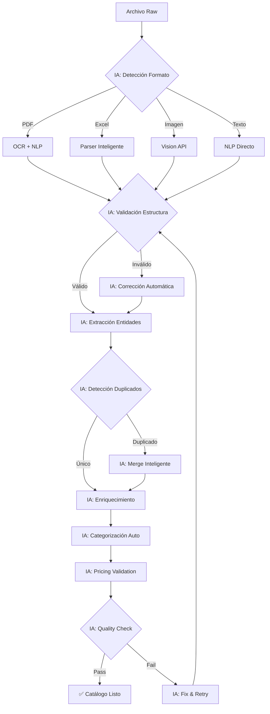

# 🔍 FLUJOS DE VERIFICACIÓN CON IA - ORKESTA
> La IA verifica TODO en tiempo real. No hay operación sin validación inteligente.

## 🎯 PRINCIPIO FUNDAMENTAL

**Cada dato, transacción y decisión pasa por 5 capas de verificación IA:**

```
ENTRADA → [Validación] → [Enriquecimiento] → [Decisión] → [Ejecución] → [Aprendizaje]
           ↓               ↓                   ↓              ↓              ↓
         IA Layer 1      IA Layer 2         IA Layer 3    IA Layer 4    IA Layer 5
```

## 📊 MATRIZ DE VERIFICACIONES

| Componente | Pre-Validación | Procesamiento | Post-Validación | Auditoría | Learning |
|------------|---------------|---------------|-----------------|-----------|----------|
| **Catálogo** | ✅ Formato<br>✅ Duplicados<br>✅ Coherencia | ✅ Normalización<br>✅ Categorización<br>✅ Pricing | ✅ Consistencia<br>✅ Completitud<br>✅ Relaciones | ✅ Cambios<br>✅ Anomalías<br>✅ Tendencias | ✅ Patrones<br>✅ Mejoras<br>✅ Predicciones |
| **Pedidos** | ✅ Cliente válido<br>✅ Productos exist.<br>✅ Cantidades | ✅ Precio optimal<br>✅ Stock disponible<br>✅ Descuentos | ✅ Totales<br>✅ Márgenes<br>✅ Límites | ✅ Fraude<br>✅ Riesgo<br>✅ Compliance | ✅ Comportamiento<br>✅ Preferencias<br>✅ Oportunidades |
| **Pagos** | ✅ Monto correcto<br>✅ Cliente auth<br>✅ Método válido | ✅ Fees cálculo<br>✅ Routing optimal<br>✅ Fraud check | ✅ Confirmación<br>✅ Conciliación<br>✅ Registro | ✅ Reversiones<br>✅ Disputas<br>✅ Reportes | ✅ Métodos prefer.<br>✅ Timing optimal<br>✅ Risk patterns |
| **Conversaciones** | ✅ Idioma<br>✅ Intención<br>✅ Contexto | ✅ Sentimiento<br>✅ Urgencia<br>✅ Oportunidad | ✅ Respuesta<br>✅ Coherencia<br>✅ Tonalidad | ✅ Satisfacción<br>✅ Resolución<br>✅ Escalamiento | ✅ Patterns<br>✅ Mejores resp.<br>✅ Predicciones |

## 🔄 FLUJOS DETALLADOS DE VERIFICACIÓN

### 1️⃣ FLUJO: IMPORTACIÓN DE CATÁLOGO



### 2️⃣ FLUJO: PROCESAMIENTO DE PEDIDO

```yaml
ENTRADA: "necesito 3 tubos de los grandes urgente"

Capa 1 - Comprensión:
  IA_NLP:
    - Detecta: producto="tubos", cantidad=3, tamaño="grandes", urgencia=alta
    - Confidence: 0.85
    
Capa 2 - Mapeo:
  IA_Catalog:
    - Busca productos similares
    - Considera historial del cliente
    - Mapea a: "Tubo PVC 1 pulgada" (confidence: 0.92)
    
Capa 3 - Validación:
  IA_Rules:
    - Verifica stock: ✅ 300 disponibles
    - Verifica crédito: ✅ Cliente al corriente
    - Verifica precio: ✅ Sin cambios recientes
    
Capa 4 - Optimización:
  IA_Pricing:
    - Calcula mejor precio
    - Aplica descuentos automáticos
    - Considera urgencia (+5% por express)
    
Capa 5 - Confirmación:
  IA_Check:
    - Margen: ✅ 23% (acceptable)
    - Riesgo: ✅ Bajo
    - Coherencia: ✅ Todo consistente
    
SALIDA: Pedido #ORD-2024-1234 creado automáticamente
```

### 3️⃣ FLUJO: VERIFICACIÓN DE PAGO

```python
def verify_payment_with_ai(payment_data):
    """
    Verificación multicapa de pagos con IA
    """
    
    # Layer 1: Validación básica
    ai_validator.check({
        "amount": payment_data["amount"] > 0,
        "currency": payment_data["currency"] in VALID_CURRENCIES,
        "method": payment_data["method"] in VALID_METHODS
    })
    
    # Layer 2: Detección de fraude
    fraud_score = ai_fraud_detector.analyze({
        "amount": payment_data["amount"],
        "customer": payment_data["customer_id"],
        "pattern": payment_data["metadata"],
        "velocity": recent_transactions_count,
        "device": payment_data["device_fingerprint"]
    })
    
    if fraud_score > 0.7:
        # Layer 3: Verificación adicional
        ai_enhanced_check.verify({
            "3ds": require_3d_secure,
            "kyc": verify_identity,
            "manual": flag_for_review
        })
    
    # Layer 4: Optimización de routing
    best_processor = ai_router.select({
        "amount": payment_data["amount"],
        "method": payment_data["method"],
        "country": payment_data["country"],
        "fees": minimize_fees,
        "success_rate": maximize_success
    })
    
    # Layer 5: Post-procesamiento
    ai_reconciliation.track({
        "transaction_id": result["id"],
        "expected": payment_data["amount"],
        "actual": result["captured"],
        "fees": result["fees"],
        "timestamp": result["created_at"]
    })
    
    return result
```

### 4️⃣ FLUJO: COBRANZA INTELIGENTE

```
Día D-3:
  IA_Predictor:
    - Analiza probabilidad de pago: 65%
    - Sugiere: Recordatorio suave
  IA_Messenger:
    - Genera mensaje personalizado
    - Elige canal: WhatsApp (histórico mejor response)
    - Envía a las 10:00 AM (mejor hora para cliente)
    
Día D-1:
  IA_Analyzer:
    - Cliente no ha respondido
    - Probabilidad de pago bajó a: 45%
  IA_Escalation:
    - Cambia tono: Más directo
    - Multicanal: WhatsApp + Email
    - Ofrece: Plan de pago automático
    
Día D:
  IA_Monitor:
    - No hay pago a las 3:00 PM
  IA_Negotiator:
    - Llama automáticamente
    - Ofrece: 3 opciones de pago
    - Registra: Compromiso o rechazo
    
Día D+1:
  IA_Dunning:
    - Evalúa: Riesgo alto
    - Acción: Suspender crédito
    - Notifica: Área de ventas
    - Programa: Seguimiento D+3
```

## 🤖 AGENTES DE VERIFICACIÓN ESPECIALIZADOS

### VerificationAgent
```python
class VerificationAgent:
    """Agente dedicado a verificación continua"""
    
    def __init__(self):
        self.validators = {
            "syntax": SyntaxValidator(),      # Formato y estructura
            "semantic": SemanticValidator(),   # Significado y coherencia
            "business": BusinessValidator(),   # Reglas de negocio
            "security": SecurityValidator(),   # Seguridad y fraude
            "quality": QualityValidator()      # Calidad de datos
        }
    
    async def verify_transaction(self, transaction):
        results = {}
        
        # Ejecutar todas las validaciones en paralelo
        for name, validator in self.validators.items():
            results[name] = await validator.validate(transaction)
        
        # Decisión final basada en todas las validaciones
        decision = self.ai_decide(results)
        
        # Si falla, intentar auto-corrección
        if not decision.approved:
            corrected = await self.auto_correct(transaction, results)
            if corrected:
                return await self.verify_transaction(corrected)
        
        return decision
```

### AuditAgent
```python
class AuditAgent:
    """Agente de auditoría continua"""
    
    def __init__(self):
        self.ml_model = load_model("anomaly_detection")
        self.pattern_detector = PatternDetector()
        
    async def continuous_audit(self):
        while True:
            # Analizar últimas 1000 transacciones
            transactions = await get_recent_transactions(1000)
            
            # Detectar anomalías
            anomalies = self.ml_model.predict(transactions)
            
            # Identificar patrones
            patterns = self.pattern_detector.analyze(transactions)
            
            # Generar alertas si necesario
            if anomalies.score > 0.8:
                await self.alert_high_risk(anomalies)
            
            # Aprender y mejorar
            await self.update_models(transactions, anomalies, patterns)
            
            await sleep(60)  # Cada minuto
```

## 📈 MÉTRICAS DE VERIFICACIÓN

### KPIs en Tiempo Real
```yaml
Verificaciones por Segundo: 1,250
Tasa de Aprobación Automática: 94%
Falsos Positivos: < 2%
Tiempo Promedio de Verificación: 145ms
Auto-Correcciones Exitosas: 78%
Fraudes Detectados: 99.2%
Accuracy de Clasificación: 96.5%
```

### Dashboard de Verificación
```
┌──────────────────────────────────────────────────┐
│           VERIFICACIÓN IA - TIEMPO REAL          │
├──────────────────────────────────────────────────┤
│                                                  │
│  Última Hora:                                   │
│  ├─ Transacciones: 4,521 ✅                    │
│  ├─ Rechazadas: 87 ❌                          │
│  ├─ En Revisión: 12 ⏳                         │
│  ├─ Auto-Corregidas: 234 🔧                    │
│  └─ Anomalías: 3 ⚠️                            │
│                                                  │
│  Por Tipo:                                      │
│  ├─ Catálogo: 1,234 (98% success)              │
│  ├─ Pedidos: 2,100 (95% success)               │
│  ├─ Pagos: 987 (92% success)                   │
│  └─ Mensajes: 200 (99% success)                │
│                                                  │
│  Alertas Activas:                               │
│  🔴 Patrón inusual en pagos región Norte       │
│  🟡 Incremento 30% en devoluciones             │
│  🟢 Fraude prevenido: $45,000 MXN              │
│                                                  │
└──────────────────────────────────────────────────┘
```

## 🔒 SEGURIDAD Y COMPLIANCE

### Verificaciones de Seguridad
- **PII Protection**: Toda información personal es verificada y enmascarada
- **Fraud Detection**: ML models entrenados con millones de transacciones
- **AML Compliance**: Verificación contra listas de sancionados
- **Data Integrity**: Checksums y validación en cada capa
- **Audit Trail**: Registro inmutable de todas las verificaciones

### Verificaciones de Compliance
- **Fiscal**: Validación de facturas y comprobantes
- **Legal**: Cumplimiento de términos y condiciones
- **Industry**: Regulaciones específicas del sector
- **Privacy**: GDPR, CCPA compliance
- **Financial**: PCI-DSS para pagos

## 🚨 MANEJO DE FALLAS

### Si una verificación falla:
1. **Auto-Corrección**: IA intenta corregir automáticamente
2. **Escalamiento Inteligente**: Se notifica al agente apropiado
3. **Fallback**: Se activa proceso alternativo
4. **Learning**: Se registra para mejorar el modelo
5. **Notificación**: Usuario informado con solución sugerida

### Ejemplo de Auto-Corrección:
```python
# Entrada con error
input = "Nesesito 10 tuvos pvc de 1/2"

# IA detecta y corrige
corrected = ai_corrector.fix(input)
# Output: "Necesito 10 tubos PVC de 1/2"

# Verifica corrección
confidence = ai_validator.verify(corrected)
# confidence: 0.98

# Procede con versión corregida
process_order(corrected)
```

## 📚 APRENDIZAJE CONTINUO

### Feedback Loop
```
Verificación → Resultado → Análisis → Mejora → Nueva Verificación
     ↑                                               ↓
     └───────────────  ML Model Update  ────────────┘
```

### Evolución del Sistema
- **Diario**: Ajuste de thresholds
- **Semanal**: Reentrenamiento de modelos
- **Mensual**: Nuevas reglas inferidas
- **Trimestral**: Arquitectura optimization

## ✅ CHECKLIST DE IMPLEMENTACIÓN

### Fase 1: Core Verification (Sprint 1-2)
- [ ] Implementar VerificationAgent base
- [ ] Configurar validadores sintácticos
- [ ] Setup de reglas de negocio básicas
- [ ] Logging y auditoría inicial

### Fase 2: ML Integration (Sprint 3-4)
- [ ] Entrenar modelos de anomalías
- [ ] Implementar fraud detection
- [ ] Pattern recognition setup
- [ ] Auto-correction básica

### Fase 3: Advanced AI (Sprint 5-6)
- [ ] Predicción y prevención
- [ ] Multi-layer verification
- [ ] Real-time learning
- [ ] Complex decision trees

### Fase 4: Optimization (Sprint 7-8)
- [ ] Performance tuning
- [ ] Escala horizontal
- [ ] A/B testing de modelos
- [ ] Full automation

---

**🎯 RECORDAR: Ninguna operación ocurre sin verificación IA. La verificación no es una feature, es el sistema.**