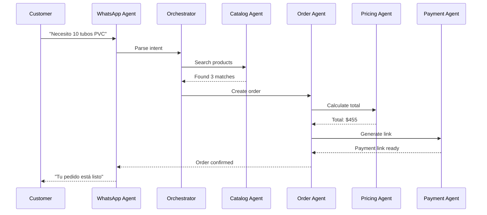
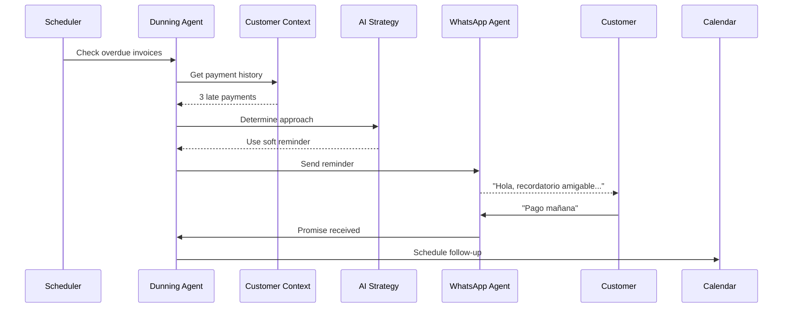
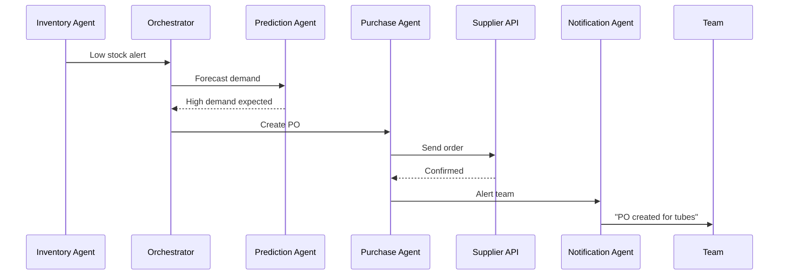

# 🔄 FLUJOS DE COMUNICACIÓN ENTRE AGENTES - ORKESTA

## 🎯 PROBLEMA A RESOLVER

Los agentes necesitan comunicarse de manera:
- **Asíncrona**: No bloquear mientras esperan respuesta
- **Confiable**: Garantizar entrega de mensajes
- **Trazable**: Auditar toda comunicación
- **Escalable**: Manejar miles de mensajes/segundo
- **Inteligente**: Enrutar basado en contexto

## 📊 INVESTIGACIÓN: PATRONES DE ARQUITECTURA (2024-2025)

### 1. **Supervisor Pattern** (LangGraph) ✅ RECOMENDADO
```
     [Supervisor Agent]
      /      |      \
[Agent A] [Agent B] [Agent C]
```

**Ventajas:**
- Control centralizado
- Fácil de debuggear
- Decisiones consistentes

**Implementación en Orkesta:**
```python
class SupervisorAgent:
    def route_message(self, message):
        # Analiza intención
        intent = self.analyze_intent(message)
        
        # Decide qué agente debe responder
        if intent == "product_search":
            return self.catalog_agent.process(message)
        elif intent == "pricing":
            return self.pricing_agent.process(message)
```

### 2. **Graph-Based Pattern** (LangGraph)
```
[Agent A] --> [Agent B] --> [Agent C]
     \           /
      [Agent D]
```

**Ventajas:**
- Flujos complejos
- Paralelización
- Estado compartido

### 3. **Conversational Pattern** (AutoGen)
```
[Agent A] <--> [Agent B] <--> [Agent C]
   ^                             ^
   |_____________________________|
```

**Ventajas:**
- Natural para chat
- Contexto preservado
- Flexibilidad

### 4. **Role-Based Pattern** (CrewAI)
```
[Manager] assigns tasks to:
  - [Researcher]
  - [Writer]  
  - [Reviewer]
```

**Ventajas:**
- Claro ownership
- Especialización
- Colaboración estructurada

## 🏗️ ARQUITECTURA PROPUESTA PARA ORKESTA

### Híbrido: Supervisor + Event-Driven

```
┌─────────────────────────────────────────────────────┐
│                 ORCHESTRATOR AGENT                   │
│              (Supervisor + Router)                   │
└────────────┬────────────────────────────────────────┘
             │
      ┌──────┴──────┐ 
      │  Event Bus  │ (Redis Pub/Sub)
      └──────┬──────┘
             │
    ┌────────┼────────┬────────┬────────┐
    ▼        ▼        ▼        ▼        ▼
[Catalog] [Order] [Payment] [Dunning] [WhatsApp]
  Agent    Agent    Agent     Agent     Agent
```

## 📝 PROTOCOLOS DE MENSAJES

### Estructura de Mensaje Estándar
```python
@dataclass
class AgentMessage:
    # Identificación
    id: str = field(default_factory=lambda: str(uuid4()))
    timestamp: datetime = field(default_factory=datetime.now)
    
    # Routing
    from_agent: str
    to_agent: str  # Puede ser "broadcast" o específico
    reply_to: Optional[str] = None  # ID del mensaje original
    
    # Contenido
    message_type: str  # "request", "response", "event", "error"
    intent: str  # "search_product", "calculate_price", etc.
    payload: Dict[str, Any]
    
    # Control
    priority: int = 5  # 1-10, donde 10 es urgente
    timeout_ms: int = 5000
    requires_ack: bool = True
    
    # Contexto
    tenant_id: str
    conversation_id: Optional[str] = None
    customer_id: Optional[str] = None
    
    # Trazabilidad
    trace_id: str = field(default_factory=lambda: str(uuid4()))
    span_id: str = field(default_factory=lambda: str(uuid4()))
```

### Tipos de Mensajes

#### 1. REQUEST (Agente solicita acción)
```python
message = AgentMessage(
    from_agent="order_agent",
    to_agent="catalog_agent",
    message_type="request",
    intent="validate_product",
    payload={
        "product_id": "p_123",
        "quantity": 10
    }
)
```

#### 2. RESPONSE (Respuesta a request)
```python
response = AgentMessage(
    from_agent="catalog_agent",
    to_agent="order_agent",
    message_type="response",
    reply_to=message.id,
    intent="product_validated",
    payload={
        "valid": True,
        "stock_available": 50,
        "price": 45.50
    }
)
```

#### 3. EVENT (Notificación broadcast)
```python
event = AgentMessage(
    from_agent="payment_agent",
    to_agent="broadcast",
    message_type="event",
    intent="payment_received",
    payload={
        "order_id": "ord_123",
        "amount": 500.00,
        "method": "stripe"
    }
)
```

#### 4. ERROR (Manejo de errores)
```python
error = AgentMessage(
    from_agent="whatsapp_agent",
    to_agent="orchestrator",
    message_type="error",
    intent="delivery_failed",
    payload={
        "error_code": "WA_001",
        "error_message": "Rate limit exceeded",
        "retry_after": 60
    }
)
```

## 🔄 FLUJOS DE COMUNICACIÓN PRINCIPALES

### FLUJO 1: Procesamiento de Orden


### FLUJO 2: Cobranza Inteligente


### FLUJO 3: Inventory Alert


## 💻 IMPLEMENTACIÓN TÉCNICA

### 1. Event Bus con Redis
```python
import redis
import json
from typing import Callable

class AgentEventBus:
    def __init__(self):
        self.redis = redis.Redis(decode_responses=True)
        self.pubsub = self.redis.pubsub()
        self.handlers = {}
    
    def publish(self, message: AgentMessage):
        # Publicar a canal específico o broadcast
        channel = f"agent:{message.to_agent}"
        self.redis.publish(channel, message.json())
        
        # Guardar en stream para persistencia
        self.redis.xadd(
            f"stream:{message.tenant_id}",
            {"message": message.json()}
        )
    
    def subscribe(self, agent_name: str, handler: Callable):
        # Suscribirse a mensajes directos y broadcast
        channels = [
            f"agent:{agent_name}",
            "agent:broadcast"
        ]
        
        self.pubsub.subscribe(*channels)
        self.handlers[agent_name] = handler
    
    def listen(self):
        for message in self.pubsub.listen():
            if message['type'] == 'message':
                agent_msg = AgentMessage.parse(message['data'])
                handler = self.handlers.get(agent_msg.to_agent)
                if handler:
                    handler(agent_msg)
```

### 2. Orchestrator Implementation
```python
class OrchestratorAgent(BaseAgent):
    def __init__(self):
        super().__init__("orchestrator")
        self.agents = {}
        self.routing_rules = {}
        
    async def route_message(self, message: AgentMessage):
        # Analizar intención con IA
        intent_analysis = await self.analyze_intent(message)
        
        # Determinar agente destino
        target_agent = self.routing_rules.get(
            intent_analysis['intent'],
            'fallback_agent'
        )
        
        # Enrutar mensaje
        routed_message = AgentMessage(
            **message.dict(),
            to_agent=target_agent
        )
        
        await self.event_bus.publish(routed_message)
        
    async def analyze_intent(self, message: AgentMessage):
        prompt = f"""
        Analiza este mensaje y determina la intención:
        Mensaje: {message.payload.get('text')}
        
        Intenciones posibles:
        - search_product: Buscar productos
        - create_order: Crear pedido
        - check_price: Consultar precio
        - payment_status: Estado de pago
        - general_question: Pregunta general
        
        Responde en JSON: {{"intent": "...", "confidence": 0.0-1.0}}
        """
        
        response = await self.llm.chat(prompt, json_mode=True)
        return json.loads(response)
```

### 3. Agent Response Handling
```python
class CatalogAgent(BaseAgent):
    async def handle_message(self, message: AgentMessage):
        if message.intent == "search_product":
            # Buscar productos
            results = await self.search_products(
                message.payload['query']
            )
            
            # Responder
            response = AgentMessage(
                from_agent=self.name,
                to_agent=message.from_agent,
                message_type="response",
                reply_to=message.id,
                intent="products_found",
                payload={"products": results}
            )
            
            await self.event_bus.publish(response)
```

## 📊 MONITOREO Y OBSERVABILIDAD

### Métricas Clave
```python
# Prometheus metrics
agent_messages_total = Counter(
    'agent_messages_total',
    'Total messages processed',
    ['from_agent', 'to_agent', 'message_type']
)

agent_message_latency = Histogram(
    'agent_message_latency_seconds',
    'Message processing latency',
    ['agent', 'intent']
)

agent_errors_total = Counter(
    'agent_errors_total',
    'Total errors in agent communication',
    ['agent', 'error_type']
)
```

### Tracing Distribuido
```python
from opentelemetry import trace

tracer = trace.get_tracer(__name__)

class TracedAgent(BaseAgent):
    async def process_message(self, message: AgentMessage):
        with tracer.start_as_current_span(
            f"agent.{self.name}.process",
            attributes={
                "message.id": message.id,
                "message.intent": message.intent,
                "tenant.id": message.tenant_id
            }
        ) as span:
            try:
                result = await self._process(message)
                span.set_status(Status(StatusCode.OK))
                return result
            except Exception as e:
                span.record_exception(e)
                span.set_status(Status(StatusCode.ERROR))
                raise
```

## 🧪 ESCENARIOS DE PRUEBA

### Escenario 1: Happy Path
```python
async def test_order_flow():
    # Cliente envía mensaje
    customer_message = "Necesito 10 tubos PVC"
    
    # WhatsApp agent recibe
    wa_agent.receive(customer_message)
    
    # Verificar que catalog agent fue llamado
    assert catalog_agent.called_with("tubos PVC")
    
    # Verificar orden creada
    assert order_agent.order_created
    
    # Verificar respuesta al cliente
    assert "Tu pedido está confirmado" in wa_agent.last_response
```

### Escenario 2: Error Handling
```python
async def test_agent_timeout():
    # Simular agente que no responde
    catalog_agent.simulate_timeout()
    
    # Enviar request
    message = AgentMessage(
        from_agent="order",
        to_agent="catalog",
        timeout_ms=1000
    )
    
    # Verificar timeout handling
    with pytest.raises(TimeoutError):
        await orchestrator.route_message(message)
    
    # Verificar fallback
    assert fallback_agent.was_called
```

### Escenario 3: Load Testing
```python
async def test_high_load():
    # Enviar 1000 mensajes concurrentes
    messages = [
        create_random_message() 
        for _ in range(1000)
    ]
    
    start = time.time()
    await asyncio.gather(*[
        orchestrator.route_message(msg) 
        for msg in messages
    ])
    duration = time.time() - start
    
    # Verificar performance
    assert duration < 10  # Menos de 10 segundos
    assert success_rate > 0.95  # 95% success
```

## ✅ DECISIONES CLAVE

1. **Redis como Event Bus**: Rápido, confiable, soporta pub/sub y streams
2. **Mensajes estructurados**: Schema consistente para todos los agentes
3. **Orchestrator centralizado**: Simplifica routing y debugging
4. **Timeout y retry automático**: Resiliencia built-in
5. **Tracing distribuido**: Observabilidad end-to-end

## 🚀 PRÓXIMOS PASOS

1. Implementar AgentMessage y EventBus
2. Crear OrchestratorAgent base
3. Definir routing rules
4. Implementar primeros 3 agentes
5. Testing de integración
6. Monitoreo con Prometheus/Grafana